# Experiment 3（改版）实验初步报告

> **写于 2026-09-29**（G5 已提交、未回传时）；**2026-09-30 更新**：G5 已回传（§5.10），各组加结果图（§0）；3-E 判定已写（§5.4）；**还没做的实验见 §9.1**。**2026-10-01**：3.3 收尾（D-082）；下一会话 = S5（D-083）。本文件是**汇总**，不是新证据：每个数都出自 `FINDINGS.md` 的原表或下面给出的脚本输出，
> 每节末尾附复现命令。与 `FINDINGS.md` 不一致时以 FINDINGS 和脚本为准（陷阱 #14：文档会比数据旧）。
>
> 路径一律相对仓库根。`hfl-mechanism/` = `experiments/attack/hfl-mechanism/`。
> 「有效轮」= 云轮 × R_edge（每云轮的 edge 轮数）；除非另说，ASR 都是 **fresh-PM 主列**（见 §3.2）。

---

## 目录

0. [结果图一览](#0-结果图一览)
1. [一页摘要](#1-一页摘要)
2. [研究问题与预注册判定](#2-研究问题与预注册判定)
3. [协议与口径](#3-协议与口径)
4. [实验组总表](#4-实验组总表)
5. [逐组数据分析](#5-逐组数据分析)
6. [3-B 详细说明](#6-3-b-详细说明)
7. [工具链与文件索引](#7-工具链与文件索引)
8. [机时账](#8-机时账)
9. [下一步与待决事项](#9-下一步与待决事项)
- [附录 A：git 瘦身](#附录-agit-瘦身)

---

## 0. 结果图一览

全部在 `hfl-mechanism/figures/final/`，由 `python3 harness/report_figures.py` 重画（数取自各组的判定脚本，与判定输出是同一份，
`tests/test_report_figures.py` 逐项核对）；F0 由 `python3 harness/partition_preview.py --plot …` 出。图内文字是英文（集群容器没有中文字体）。

| 图 | 回答什么 | 小节 |
|---|---|---|
| [`F7_G5_convergence_gating.png`](figures/final/F7_G5_convergence_gating.png) | 3.3：植入受不受收敛门控 → **not_gated** | §5.10 |
| [`G5AB_generator_semantics.png`](figures/final/G5AB_generator_semantics.png) | 窗口外生成器冻结 / 在训有没有区别 → 没有 | §5.9 |
| [`F1_floor_G0_FLR.png`](figures/final/F1_floor_G0_FLR.png) | 3.1：不投毒时同一触发器有多高（floor） | §5.6 |
| [`F4_3B_G3.png`](figures/final/F4_3B_G3.png) | 3-B：差中差为什么是机械结果 | §6 |
| [`3E_G6_G6D.png`](figures/final/3E_G6_G6D.png) | 3-E：edge 内共享段能不能挡住跨 edge 传播 | §5.4 / §5.5 |
| [`F3_decay_G8_G8F.png`](figures/final/F3_decay_G8_G8F.png) | 3-C：攻击者走后后门怎样衰减；flat 是否一样 | §5.7 / §5.8 |
| [`G7_preprocessing.png`](figures/final/G7_preprocessing.png) | 官方预处理是否让攻击更容易（背景） | §5.3 |
| [`G2P_T50_ratio.png`](figures/final/G2P_T50_ratio.png) | 3-A pilot：HFL 比 flat 植入快还是慢（单 seed） | §5.2 |
| [`F0_partitions.png`](figures/final/F0_partitions.png) | S3 各划分的实测异质性 | §3 / PLAN §6 |
| [`status_progress.png`](figures/final/status_progress.png) | **还有哪些没跑**：各组 run 数按状态 + 机时（已用 / 外推待用） | §9.1 |
| [`3E_verdict_G6.png`](figures/final/3E_verdict_G6.png) | 3-E 的预注册判定：两臂都 **blocks** | §5.4 |
| [`F3b_decay_margin_tail.png`](figures/final/F3b_decay_margin_tail.png) | 3-C：攻击者走后 margin 与长尾（HFL 对 flat） | §5.7 |
| [`F4b_3B_all_partitions.png`](figures/final/F4b_3B_all_partitions.png) | 3-B：全部 24 个 G3 run 的逐 edge 原始 ASR | §6.5 |
| [`pilot_A4.png`](figures/final/pilot_A4.png) | A4 pilot：lr 日程、FedRep 顺序、一卡多跑（P1，背景） | §5.1 |

---

## 1. 一页摘要

**研究问题**：在三层联邦学习（cloud – edge – client）中，客户端用 FedRep 个性化（私有 head、私有 BN 统计量）时，
Bad-PFL 个性化后门**怎样植入、怎样在 edge 之间传播、攻击者走后怎样衰减**；edge 这一层能提供什么防御。
原始规划见 `hfl-mechanism/PLAN-original-2026-09-24.md`，执行计划见 `hfl-mechanism/PLAN.md`。

**进度**（`python3 harness/status.py hfl-mechanism/registry.yaml`，2026-09-29）：

| 状态 | run 数 | 组 |
|---|---|---|
| 已回传、已核对 | 83 | FLR 3、G0 15、G3 24、**G5 15**、G5AB 8、G6 9、G6D 3、G8 3、G8F 3 |
| 已回传、配置已变（`stale`，按 D-053 默认不重交） | 6 | G7（评估降频改了 base 的 config_sha；结果仍有效） |
| 挡住（等功能会话） | 91 | G1 24（S5 + S6）、G2 55（S5，暂缓 D-056）、G4 12（S6 + 3.2 重新表述，搁置 D-047） |
| pilot（P1 口径，不进结论） | 13 | DET 2、D029 2、A26 2、G2P 2 新格、PACK 5（另 2 格复用 D029） |

已用约 **99 GPU-h**（§8）。另有旧方案 P1 的 26 个 run、P0 的 30 个归档，只作背景。

**主要发现**：

1. **实验地基可靠**。P2 口径下同配置同 seed **跨节点逐位可复现**（F-045），跨提交也逐位（F-050）；
   S9 仪表与存盘开关在 GPU 上**不改任何已有的数**（F-067，1950 个字段 × 3 seed）；一卡三跑加速比 2.86 且 checksum 不变（F-048）。
2. **攻击在 P2 下接近饱和**：攻击者所在 edge 的良性端约 0.97–1.0，global ASR 约 0.998。天花板贯穿多个子实验，是 3-B 判不出来的直接原因（§6）。
3. **3.1 下限**：ρ=0 影子攻击者（生成器照训、一张不投毒）下的 floor_gen = **0.04–0.10 < 0.3** → 「平台期主要来自对抗脆弱性」**不成立**（F-073）。
   但 floor 不可忽略（FLR：0.05–0.13，F-065），且**跟着本 edge 的目标类占比走**（y_t 0.005 → 0.001–0.008；0.30 → 0.16–0.20）。
4. **3-E edge 内共享段**：攻击者集中在一个 edge 时，把受害 edge 的 ASR 压低 **0.49–0.92**，fresh MTA 代价 0.005–0.020（F-061 / F-065③）；
   **预注册判定两臂都 `blocks`**（F-077，§5.4）；
   攻击者分散到每个 edge 时只压低 0.02–0.03（G6D，止步，F-069）。**只隔离、不治愈**：与攻击者同 edge 的良性端各臂都是 0.92–1.0。
5. **3-C 攻击停止后的衰减**：攻击者走后后门**大部分褪去**（受害 edge 保留约 15%），margin 中位数一路下降、没有平台（F-068，用户按「退回 floor」处理，D-076）；
   **flat 也同样衰减**（F-071）→ 衰减不是 HFL 结构造成的。外部 1B-2（官方代码、flat）经用户复核是「200 轮后约 **0.35**」（原记 0.45，已更正）：
   定性一致（都大幅衰减、没有停在高位平台），本管线在同一时刻低 0.15–0.23（§5.8）。
6. **白盒 ASR ≈ 主列**：攻击者不知道受害者的私有 head 也拿到白盒级 ASR → 私有 head 挡不住 ξ（F-051）。**fresh-PM 会低估干净精度**，10edge 达 0.094。
7. **3-B**：预注册差中差 CI 全 > 0（方向与假设相反），但那是**天花板下 floor 差的机械结果** —— 原始差中差只有 +0.003 / +0.020 / +0.008，
   excess 的差几乎全部来自 C3 的 E3 floor 低（§6）。**3-B 在当前攻击强度下判不出来**。
8. **3-A**：G2P 单 seed，HFL / flat 的 T50 比值方向与旧 P1 一致但**不单调**（4edge 0.51 < 2edge 0.77 < flat 1 < 10edge 2.97，F-049）；G2 的规模未定。
9. **G5AB**：两种生成器语义（窗口外冻结 / 全程在训）的峰值与稀释值差 ≤ 0.035 → G5 用 A（D-080）。
10. **3.3 收敛门控：`not_gated`**（G5，F-076）。投毒窗口从欠训练（pm_acc 0.55）移到接近收敛（0.84），峰值 excess 都在 0.14–0.32、
    不随 t0 单调变化（逐 seed ρ = 0.1 / 0.0 / −0.3）。攻击者所在 edge 的良性端**在每个 t0 都一开窗就饱和**；
    池化峰值里随 t0 变化的部分是向受害 edge 的传染（§5.10 的图）。→ **没有「训练后期更安全」的时段**。

**还没做的**（§9.1，`status_progress.png`）：G1（24 run，3-C 锯齿 + 3-D，缺 S5 + S6）、G2（55 run，3-A，缺 S5、规模未定）、
G4（12 run，3.2，搁置），外推至少约 82 GPU-h；另有几项分析与出图（G8 存盘的离线分析、hdir 的 floor、3-B 后续、F2 / F5 / F6）。

**待你决定的**（§9.2）：3-B 的出路（三选一或都不做）、git 瘦身（不改历史 / 改写历史）、G2 规模与 S5、G1 的重新规划（S5 + S6）、G8 存盘何时删。

---

## 2. 研究问题与预注册判定

判定规则都在数据回来**之前**写进 `PLAN.md` §3 或 DECISIONS；「事后」的判据单独标注。seed 数不够 → `insufficient`，不报方向。
3 个 seed 做 bootstrap 时 CI 下界 = 最小的 seed 值（27 种重采样里「三次抽到最小者」的概率 1/27 > 2.5%），所以「CI 全 > 0」⇔ 三个 seed 都 > 0。

| 子实验 | 问题 | 组 | 预注册判定（规则） | 状态 / 结论 |
|---|---|---|---|---|
| **3.1** 对抗下限 | ASR 平台期里有多少是「触发扰动本身的对抗效应」 | FLR、G0 | floor_gen ≥ 0.3 → 平台期主要来自对抗脆弱性 | ✅ **不成立**：floor_gen 0.04–0.10（F-073）；floor 不可忽略（F-065） |
| **3.2** 私有头吸收 | 私有 head 能不能吸收掉后门 | G4 | 原文 §3.2 的三条预测 | ⏸ 搁置（D-047：FedAvg 臂立刻被攻陷、给不出结论；等重新表述）。反面信号：白盒 ≈ 主列（F-051） |
| **3.3** 收敛门控 | 植入难度是否随模型收敛程度上升 | G5AB → G5 | 峰值 excess 随 t0 的 Spearman ρ，CI > 0 → gated（D-081） | ✅ **`not_gated`**：ρ 0.1 / 0.0 / −0.3，均值 −0.067，CI [−0.3, 0.1]（F-076）；**收尾**（D-082，2026-10-01） |
| **3-A** 公平对照 | HFL 是否结构性地延迟植入 | G2P → G2 | log(T50_HFL / T50_flat) 的 CI 全 > 0 → 结构性延迟 | 🔸 G2P 单 seed、方向与 P1 一致（F-049）；G2 暂缓（D-056） |
| **3-B** 目标类分布 | 迁移是否依赖受害 edge 有没有目标类的自然样本 | G0 + G3 | excess 差中差 CI 全 < 0 → 依赖自然特征；含 0 → 无差异 | ⚠ **两支都没落上**：CI 全 > 0，机械结果（§6） |
| **3-C** 锯齿 | 干净 edge 在一个云周期内能不能自清洁 | G1 | r_down 的 CI 全 > 0 → edge 级隔离可用 | ⏸ 等 S5（逐 edge 轮评估）+ S6 |
| **3-C 衰减** | 攻击者走后后门是否持续 | G8 | 第 51–60 轮 excess 三个 seed 全部 ≥ 0.10 → persists；全部 ≤ 0.05 → decays_to_floor | ✅ `user_decides`（0.092 / 0.037 / 0.140）→ 用户判「退回 floor」一支（D-076） |
| 3-C 衰减的 flat 对照 | 衰减来自 HFL 结构还是训练协议 | G8F | 第 255–300 有效轮池化 ASR 全部 ≥ 0.35 → flat_plateau；全部 ≤ 0.25 → flat_decays | ✅ `user_decides`（0.194 / **0.286** / 0.170）；末窗口三个 seed 都 ≤ 0.20 |
| **3-D** 可观测性 | edge 视角能否比全局视角更好地检测恶意更新 | G1 | ΔAUROC（等池大小）CI 全 > 0 | ⏸ 等 S3 ✅ + S6 |
| **3-E** 三层个性化 | edge 内共享段能否阻断跨 edge 传播 | G6、G6D | 受害 edge ASR 下降 CI 全 > 0，且 fresh MTA 下降 ≤ 0.02（D-071） | ✅ **两臂都 `blocks`**：ΔASR 均值 0.52 / 0.73（CI 下界 0.49 / 0.54），ΔMTA 最大 0.007 / 0.020（F-077；判定脚本写于数据之后）。G6D 止步 |
| FLR（floor 验证） | floor 是否可忽略，决定 G0 的规模 | FLR | 某 edge ≥ 0.10 或 E0 与受害 edge 差 ≥ 0.05 → 不可忽略 | ✅ **不可忽略** → G0 逐划分测（F-065） |
| G5AB（生成器语义） | 窗口外生成器冻结 / 全程在训，结果是否不同 | G5AB | 全部 \|B − A\| < 0.10 → insensitive → G5 用 A | ✅ `insensitive`（≤ 0.035，F-072） |
| G7（预处理） | 官方预处理是否降低攻击难度 | G7 | **事后判据**（D-049） | 「是」，但干净精度低约 0.10（混杂，F-050） |
| pilot（A4 验收） | 对齐改动是否可行、是否可复现 | D029 / A26 / DET | D-029 / D-031 / A15 的判据 | ✅ D-029 pass、A15 pass、D-031 different → 维持 head_first（F-045 / D-045） |

图例：✅ 已判定；🔸 有读数、判定不完整；⚠ 判定落在预注册分支之外；⏸ 挡住 / 搁置。

---

## 3. 协议与口径

### 3.1 口径版本（`PLAN.md` §0）

| 版本 | 含义 | 位置 | 能否进结论 |
|---|---|---|---|
| P0 | 探针修正（陷阱 #11）之前的归档 | `experiments/attack/hfl-propagation/results/archive-pre-fix/`（30 个） | 否 |
| P1 | 统一标准后的旧方案 seed42 批次；以及 pilot | `experiments/attack/hfl-propagation/results/`（26 个）、`hfl-mechanism/pilot/results/P1/` | 否，只作试点 |
| **P2** | `AUDIT.md` 全部关闭之后（2026-09-27）的正式批次 | `hfl-mechanism/results/P2/<组>/` | **是** |

⚠ `run.provenance.protocol` 是**代码**版本（升 P2 之后连重跑 P1 配置也记 P2）；一格是不是 P2 **配置**看 `run.alignment.template == "p2"`。

### 3.2 P2 的关键设定

- **数据 / 模型**：CIFAR-10，100 客户端，每轮参与 10%；`resnet10_torch`（stride-2 卷积与 BN 对齐 torch，BN 推理路径避开 GPU 确定性的坑，陷阱 #23）。
- **个性化**：FedRep，head = 末层 Dense（D-030），**head_first**（D-045），BN 的 γ/β 共享、moving 统计量私有（D-032）。本地 5 个 epoch（D-024），lr 0.992^有效轮 衰减（D-023，陷阱 #21）。
- **攻击**：Bad-PFL，触发 = x + ξ + δ。ξ = 单步 PGD，在**固定攻击者**的 fresh-PM 上求（对齐官方，D-004）；δ = 攻击者的生成器。目标类 y_t = 0（airplane）。
  10 个恶意端（全局 10%），投毒率 ρ = 0.2（伯努利），ASR 只数非目标类样本。
- **HFL**：edge 按 edge 轮交错执行（D-036），参与配额按有效轮轮转（D-036 / 陷阱 #12）。
- **确定性**：`enable_op_determinism()`（A15 / D-043）+ 每轮 `[Checksum]`；**每个 run 恰好 4 个 CPU 核**（核数会改变结果，F-047）。
- **评估（D-033）**：主列 = **fresh-PM** = [当前 edge body, 自己的 head, 自己的 BN 统计量]，pm_acc 与 ASR 在**同一个模型**上测；
  陈旧 PM（`client.model`，上次被选中时的 body）作副列，隔点算（D-050 / D-054）；白盒 ASR 关（D-050）。
- **划分**：G6 / G7 用旧 noniid；S3 之后的组用等大小（每端 500 张 = 375 训练 / 125 留出）、无放回的新划分（D-065）：
  `equal_random`、机构式比例表 C1–C4（D-062 / D-067）、层级 Dirichlet（社区口径，D-063）。
- **floor 与 excess**：floor = 同 seed、同划分、同拓扑的 **ρ=0 影子攻击者**（恶意端在场、生成器照训、一张不投毒）在**同一批轮次**的 ASR；excess = ASR − floor。
- **终值**：末 10 个评估点的均值（`runs_table`）；各单组判定有自己写定的窗口（见各脚本 docstring）。

### 3.3 S9 之后常开的评估仪表（D-072）

`[EvalDetail]` / `[EvalDetailEdge]` / `[ClientEval]`：逐客户端 ASR 与干净精度、**触发样本 margin**（log p_t − max_k log p_k 的分位数，
正 = 判成目标类的把握）、干净样本判为 y_t 的比例、按类 ASR、非目标翻转率。**G8 / G6D / G0 / G5AB / G8F / G5 有这些列；G3 / G6 / FLR / G7 没有**（它们在 S9 之前交的）。

---

## 4. 实验组总表

GPU-h = 包的实测墙钟 × 1 卡（§8）。配置都在 `hfl-mechanism/configs/<run_id>.yaml`（pilot 在 `hfl-mechanism/pilot/configs/`），
由 `registry.yaml` materialize 生成；结果在 `hfl-mechanism/results/P2/<组>/<run_id>.metrics.json`，包资源在同目录 `*.gpu.json`。

| 组 | 目的 | 配置要点 | run | 状态 | GPU-h | 判定脚本 → 输出 | 判定 | FINDINGS / DECISIONS |
|---|---|---|---|---|---|---|---|---|
| pilot DET | A15 确定性 | 2edge R5、5 云轮 × 2 次（不同节点） | 2 | ✅ | 0.7 | `harness/pilot_a4.py hfl-mechanism/pilot/registry.yaml` | pass（checksum 逐轮相同） | F-045 |
| pilot D029 | 按有效轮衰减 lr 的可行性 | flat / 2edge-R5，模板全开 | 2 | ✅ | 4.5 | 同上 | pass | F-045 / D-029 |
| pilot A26 | FedRep 训练顺序 | body_first × flat / 2edge | 2 | ✅ | 4.4 | 同上 | different → head_first | F-045 / D-045 |
| pilot G2P | 3-A 一致性复测 | flat / 2 / 4 / 10 edge × R5，s42（flat、2edge 复用 D029） | 2 新 | ✅ | 5.7 | 同上（G2P 段） | consistent | F-049 |
| pilot PACK | 一卡多跑 | DET × K=2 / K=3 | 5 | ✅ | 0.8 | `harness/pack_test.py` | K=3 采用（2.86×） | F-048 / D-048 |
| **G7** | 官方预处理 | 2edge-R5 × {std, official} × 3 seed | 6 | ✅（stale） | 11.7 | `harness/g7_posthoc.py` | 事后判据「是」+ 混杂 | F-050 / D-049 |
| **G6** | 3-E 三层个性化 | 4 edge、[10,0,0,0]、R5、noniid、固定 300 有效轮；edge_shared_blocks {0,1,2} × 3 seed | 9 | ✅ | 15.6 | `harness/g6_verdict.py` → `analysis/g6_verdict.json` | **blocks**（b、c） | F-055 / F-061 / F-062 / F-065③ / F-077 |
| **FLR** | floor 量级 | G6(a) × ρ=0 × 3 seed | 3 | ✅ | 3.0 | `harness/flr_verdict.py` → `analysis/flr_verdict.json` | **不可忽略** | F-065 / D-061 |
| **G3** | 3-B | C1–C4 + hdir α_e {0.1,0.3,1,10} × 3 seed；4 edge [10,0,0,0] R5；停止判据开 | 24 | ✅ | 18.5 | `harness/g3_did.py` → `analysis/g3_did.json` | opposite（机械，§6） | F-066 / F-073 |
| **G8** | 3-C 衰减 | G6(a) + 第 1–30 云轮投毒 + 观察到第 70 轮；logits 每点 + 快照 30 / 70 | 3 | ✅ | 3.1 | `harness/decay_verdict.py` → `analysis/decay_verdict.json` | user_decides → D-076 | F-067 / F-068 |
| **G6D** | 3-E 分散布点 | G6 三臂 × [3,3,2,2] × s42 | 3 | ✅ | 3.2 | go / no-go（D-075） | **止步** | F-069 |
| **G0** | floor 主干 | {random, C1–C4} × ρ=0 × 3 seed；固定 60 云轮 | 15 | ✅ | 12.2 | 读数 + `g3_did.py` 的 floor | floor_gen < 0.3 | F-073 / D-066 / D-078 |
| **G5AB** | 生成器语义 | t20 / t140 × {A, B} × s42 / s43 | 8 | ✅ | 4.8 | `harness/g5ab_verdict.py` → `analysis/g5ab_verdict.json` | insensitive → A | F-072 / D-079 / D-080 |
| **G8F** | 衰减的 flat 对照 | 1 edge、350 轮、第 1–150 轮投毒、每 5 轮评估 × 3 seed | 3 | ✅ | 4.6 | `harness/decay_verdict.py --flat` → `analysis/flat_verdict.json` | user_decides | F-071 / D-077 |
| **G5** | 3.3 收敛门控 | G0-random 配置；t0 {20,60,100,140,180} × 20 有效轮投毒 + 55 有效轮观察 × 3 seed；A 语义 | 15 | ✅ | 6.4 | `harness/g5_verdict.py` → `analysis/g5_verdict.json` | **not_gated** | F-076 / D-078 / D-080 / D-081 |
| G1 | 3-C 锯齿 + 3-D | 4 edge；{random, C1} × {collocated, distributed} × R {10, 20} × 3 seed | 24 | ⏸ S5 + S6 | — | — | — | D-074 / D-076 |
| G2 | 3-A 结构扫描 | flat + edge {2,4,10} × R {2,5,10,20} × 5 seed | 55 | ⏸ 暂缓 | — | `harness/verdicts.py` | — | D-047 / D-056 |
| G4 | 3.2 私有头 | ρ {0.25, 1} × {FedRep, FedAvg} × 3 seed | 12 | ⏸ 搁置 | — | — | — | D-047 |

---

## 5. 逐组数据分析

### 5.1 pilot：P2 地基（F-045 / F-047 / F-048）

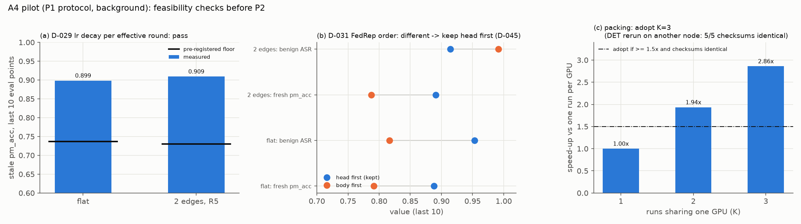

*读图*：(a) 按有效轮衰减 lr 之后，两格的陈旧 pm_acc 末 10 点 0.899 / 0.909，远高于预注册门槛（黑线）→ D-029 pass；
(b) FedRep 先训 head（蓝）与先训 body（橙）：先训 body 的干净精度低约 0.10 → 判 different，维持 head first；
(c) 一张卡并行 K 个 run 的加速比：K=3 为 2.86×（门槛 1.5×），且前 5 轮 checksum 与单跑逐位相同 → 采用 K=3。P1 口径，只作背景。

- **可复现**：DET 两次在不同节点（n553 / n137），前 5 轮 checksum 逐轮相同，所有指标到小数点后 4 位相同。
  另 `G7__std__s42` 与 pilot `D029__2edge_distributed__s42` **全部指标逐位相同**（提交不同、基配置写法不同，F-050）。
  前提：`training.deterministic_ops` 开（P2 模板开了）且每 run 恰好 4 核（CPU 上 2 核与 4 核的 checksum 不同，F-047）。
- **D-029 pass**：按有效轮衰减 lr 下陈旧 pm_acc 末 10 点 flat 0.8985、2edge 0.9093，远高于门槛 0.74 / 0.73。
- **D-031 different**：body_first 的 fresh pm_acc 低约 0.10 → 维持 head_first（D-045）。
- **攻击接近饱和**：head_first 下 global ASR 0.998 / 0.999、fresh 良性 ASR 0.95 / 0.91 —— 当时就记下「跨拓扑比较可能撞天花板」。
- **一卡多跑**：K=3 加速比 2.86、每 run 机时 0.35 × 单跑，checksum 全等于 DET（F-048）；每 run 真实显存约 17 GiB（F-055）。

```bash
python3 harness/pilot_a4.py experiments/attack/hfl-mechanism/pilot/registry.yaml
python3 harness/pack_test.py --help
```

### 5.2 G2P：3-A 的一致性复测（F-049，单 seed，`provisional`）

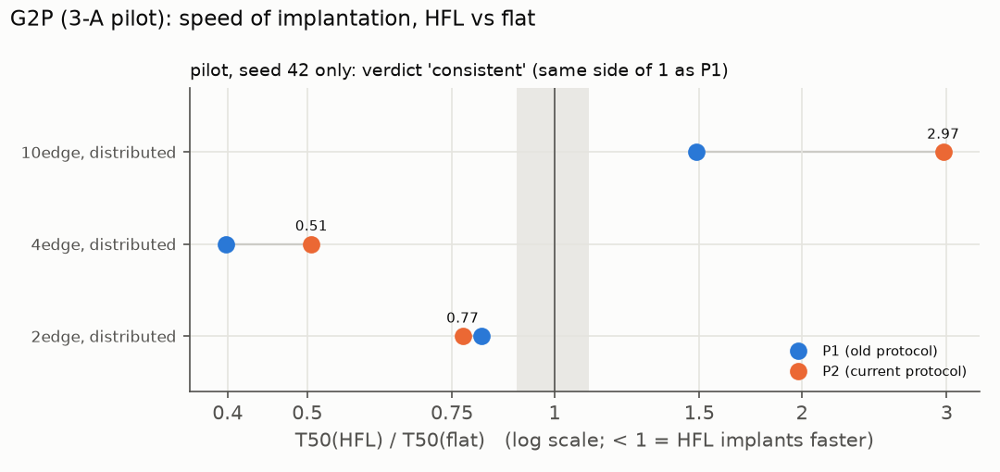

*读图*：每行一个拓扑，横轴是 T50(HFL)/T50(flat)（对数轴，< 1 = HFL 植入更快）。蓝 = 旧 P1，橙 = 当前 P2；两点在 1 的同一侧就算「一致」。
2edge / 4edge 在左、10edge 在右，而且 10edge 在 P2 下更慢（2.97）—— **只有 seed 42**。

T50 = 良性 ASR 首次越过 0.5 的有效轮（每 5 有效轮一个点、线性插值），r = T50(HFL) / T50(flat)：

| 格 | P2：T50 → r | P1：T50 → r | 末 10 良性 / global（P2） |
|---|---|---|---|
| flat | 43.2 → 1 | 57.4 → 1 | 0.953 / 0.998 |
| 2edge-R5 | 33.4 → **0.77** | 46.8 → 0.82 | 0.914 / 0.999 |
| 4edge-R5 | 21.9 → **0.51** | 22.8 → 0.40 | 0.996 / 1.000 |
| 10edge-R5 | 128.3 → **2.97** | 85.5 → 1.49 | 0.733 / 0.998 |

- 判定 `consistent`（只看比值在 1 的哪一侧）。结构相同且**非单调**：4edge 最快，10edge 最慢。10edge 的变化出在 global 模型本身。
- **没有证据的**：幅度变化的原因；幅度本身在单 seed 下可能是噪声（G7 标准臂换 seed 时 T50 在 19.7–44.4 之间变 2.2 倍）。

### 5.3 G7：官方预处理（F-050，事后判据）

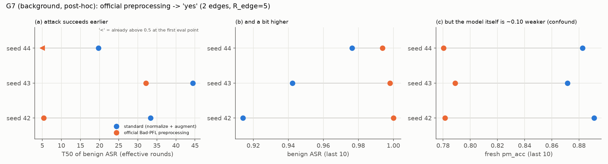

*读图*：每行一个 seed，蓝 = 标准预处理、橙 = 官方预处理。(a) 官方臂越过 0.5 更早（「<」= 第一个评估点就已越过）；
(b) 末 10 点 ASR 略高；(c) 但干净精度低约 0.10 → 「攻击更容易」与「模型更弱」分不开。

| seed | 良性 T50 std / official | 末 10 良性 ASR std / official | fresh pm_acc 差 |
|---|---|---|---|
| 42 | 33.4 / 5.4 | 0.914 / 1.000 | −0.110 |
| 43 | 44.4 / 32.2 | 0.942 / 0.998 | −0.083 |
| 44 | 19.7 / < 首点 | 0.977 / 0.994 | −0.102 |

官方预处理（不标准化、不增强）下攻击更快、更强，但模型本身弱约 0.10 → 「攻击更容易」与「模型更差」**分不开**。
这 6 个 run 现在是 `stale`（评估降频改了 base 的 config_sha，D-053 默认不重交）；数字本身不受影响。

```bash
python3 harness/g7_posthoc.py
```

### 5.4 G6：3-E 三层个性化（F-061 / F-062 / F-065③，快速读数，`provisional`）

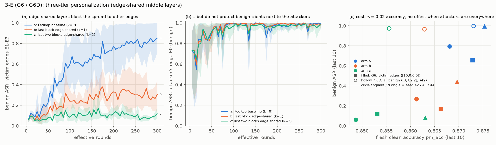

*读图*：(a) 受害 edge（E1–E3）的 ASR：基线 a 一路升到约 0.8，把最后 1 / 2 个残差块改为 edge 内共享（b / c）后压到约 0.3 / 0.1；
(b) 与攻击者同在 E0 的良性端三臂都约 1.0 —— **只隔离、不治愈**；(c) 横轴是精度、纵轴是末值 ASR：实心（G6）的代价 ≤ 0.02，
空心（G6D，攻击者分散到每个 edge）三臂都约 1.0 —— 攻击者到处都有时这一招无效（§5.5）。带子 = 3 个 seed 的 [min, max]。

末 10 个评估点均值；受害 = E1–E3 均值；集中布点 [10,0,0,0]（E0 里 10 个攻击者 + 15 个良性端）。

| 臂（edge 段） | E0 良性端（s42 / s43 / s44） | 受害 E1–E3 | fresh pm_acc | 陈旧 pm_acc |
|---|---|---|---|---|
| a（k=0，FedRep 基线） | 0.978 / 0.970 / 1.000 | 0.794 / 0.657 / 0.995 | 0.868 / 0.873 / 0.875 | 0.907 / 0.906 / 0.913 |
| b（k=1，最后 1 个残差块只在 edge 内共享） | 0.995 / 0.956 / 1.000 | 0.267 / 0.169 / 0.438 | 0.861 / 0.866 / 0.870 | 0.895 / 0.895 / 0.900 |
| c（k=2） | 0.999 / 0.918 / 1.000 | 0.061 / 0.117 / 0.078 | 0.849 / 0.853 / 0.863 | 0.878 / 0.878 / 0.887 |

- 按 seed 配对：受害 edge (b)−(a) = −0.53 / −0.49 / −0.56；(c)−(a) = −0.73 / −0.54 / −0.92。fresh pm_acc (b)−(a) ≈ −0.005 … −0.007；(c)−(a) = −0.019 / −0.020 / −0.012。
- **(a) 的受害 edge 到 300 有效轮仍在上升**（s43：eff100 0.35 → eff300 0.71，F-062），E0 在 60–100 有效轮饱和。
- **防御含义**：阻断效应大 → edge 内共享是值得做的防御维度；但 E0 内部的良性端各臂都 0.92–1.0 → 需要 edge 内检测（3-D）。
- 表中 b / s44 的陈旧 pm_acc 原记「—」，现按 `runs_table.window_mean` 的锚点口径读出 0.900（`g6_verdict.py`）。

**预注册判定（S7，F-077）**：`harness/g6_verdict.py`。规则是 PLAN §3 的 3-E 行（D-059 / D-071，数据回来前定），**脚本写于数据回来之后**。

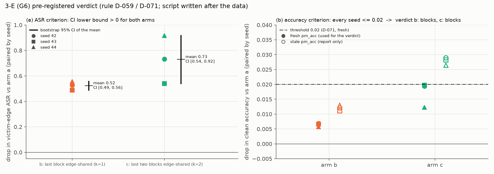

*读图*：(a) 每个 seed 的受害 edge ASR 比臂 a 低多少，黑线是均值的 bootstrap 95% CI，两臂的 CI 都远离 0；
(b) 干净精度降了多少：实心 = fresh（判定用），全部在 0.02 线下；空心 = 陈旧列（只报告）。

| 臂 | ΔASR s42 / s43 / s44（均值，CI） | ΔMTA fresh s42 / s43 / s44 | 判定 |
|---|---|---|---|
| b | 0.527 / 0.488 / 0.557（0.524，[0.488, 0.557]） | 0.0069 / 0.0066 / 0.0057 | **blocks** |
| c | 0.733 / 0.540 / 0.918（0.730，[0.540, 0.918]） | 0.0194 / 0.0197 / 0.0123 | **blocks** |

- 0.02 的门槛按 seed 均值与按逐 seed 两种读法**都成立**（c 臂最大 0.0197，贴线）。
- **陈旧列的精度代价更大**：c 臂 0.027–0.029，**超过 0.02**。判定按 D-071 用 fresh 列，所以结论不变，但「代价 ≤ 0.02」只对 fresh 口径成立。
- 判定用原始 ASR。「三臂 floor 相同」没有证据（D-059）：edge 段改变了受害模型，ρ=0 的 floor 可能随臂变化，这组数据测不出。
- ΔASR–ΔMTA 权衡（D-071，只报告）：每损失 1 个百分点 fresh 精度，b 换来约 0.82、c 约 0.43 的 ASR 下降。

```bash
python3 harness/g6_verdict.py --json experiments/attack/hfl-mechanism/analysis/g6_verdict.json
```

### 5.5 G6D：分散布点下的 3-E（F-069）

（图见 §5.4 (c) 的空心点。）

s42、布点 [3,3,2,2]（每个 edge 都有攻击者）：良性端 ASR (a) 0.999、(b) 0.966、(c) 0.975 → (b)−(a) = −0.033、(c)−(a) = −0.024，
远小于 go 门槛 0.15 → **止步**。精度代价照付（fresh −0.010 / −0.017）。
**结论**：3-E 只对「攻击者集中在少数 edge」的威胁模型有意义。

### 5.6 FLR 与 G0：floor（F-065 / F-073）

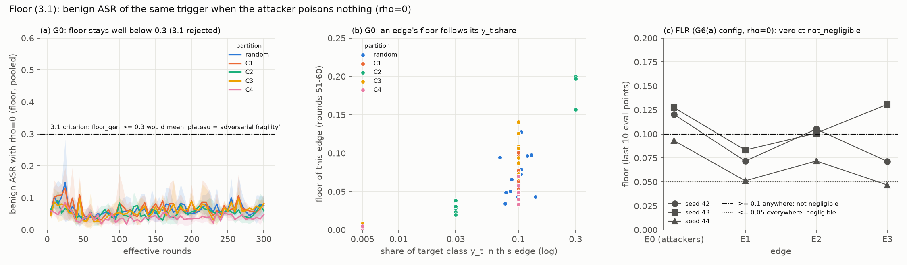

*读图*：floor = 攻击者**一张都不投毒**（ρ=0 影子攻击者，生成器照训）时，良性端对触发样本判成目标类的比例。
(a) 5 种划分的池化 floor 全程在 0.03–0.15，远低于 3.1 的 0.3 判据线 → 3.1 不成立；
(b) 每个点是一个 (划分, seed, edge)：本 edge 目标类占比越高，floor 越高（0.005 → ≈0，0.3 → 0.16–0.20）；
(c) FLR（G6(a) 配置）逐 edge 的 floor 超过 0.10 → 「不可忽略」→ G0 逐划分测。

**FLR**（G6(a) × ρ=0，末 10 点）：

| seed | floor E0 / E1 / E2 / E3 | 同 seed G6(a) 攻击 E0 / E1 / E2 / E3 |
|---|---|---|
| 42 | 0.120 / 0.072 / 0.105 / 0.071 | 0.978 / 0.758 / 0.839 / 0.785 |
| 43 | 0.127 / 0.083 / 0.101 / 0.131 | 0.970 / 0.652 / 0.669 / 0.650 |
| 44 | 0.093 / 0.051 / 0.072 / 0.047 | 1.000 / 0.995 / 0.995 / 0.996 |

某 edge ≥ 0.10 → **不可忽略** → G0 逐划分测。

**G0**（第 51–60 轮，三个 seed 的范围）：

| 划分 | E0 / E1 / E2 / E3 | 池化 floor | y_t 占比 E0 / E1 / E2 / E3 |
|---|---|---|---|
| random | 0.04–0.13 / 0.03–0.08 / 0.04–0.10 / 0.05–0.10 | 0.04–0.10 | 各约 0.10 |
| C1 | 0.06–0.10 / 0.05–0.11 / 0.05–0.10 / 0.05–0.08 | 0.06–0.10 | .10 × 4 |
| C2 | **0.16–0.20** / 0.03–0.04 / 0.02–0.03 / 0.02 | 0.05–0.06 | .30 / .03 / .03 / .03 |
| C3 | 0.11–0.13 / 0.09–0.14 / 0.07–0.09 / **0.002–0.008** | 0.06–0.08 | .10 / .10 / .10 / .005 |
| C4 | **0.001–0.005** / 0.03–0.05 / 0.04–0.07 / 0.03–0.05 | 0.04–0.05 | .005 / .10 / .10 / .10 |

- **floor 跟着本 edge 的 y_t 占比走**（机制是推理：干净样本判成 y_t 的比例只有 0.011–0.020，不是模型偏向 y_t 的直接表现）。
- **3.1 的判据**：floor_gen（random 的池化 floor）0.04–0.10 < 0.3 → 不成立。
- G0 固定 60 轮（D-078：ρ=0 时停止判据永远不满足，自适应必然跑满、`cap_reached` 是假的删失）。

```bash
python3 harness/flr_verdict.py
python3 harness/g3_did.py          # floor 与 excess 的逐 edge 表（§6）
```

### 5.7 G8：攻击停止后的衰减（F-068 / D-076）

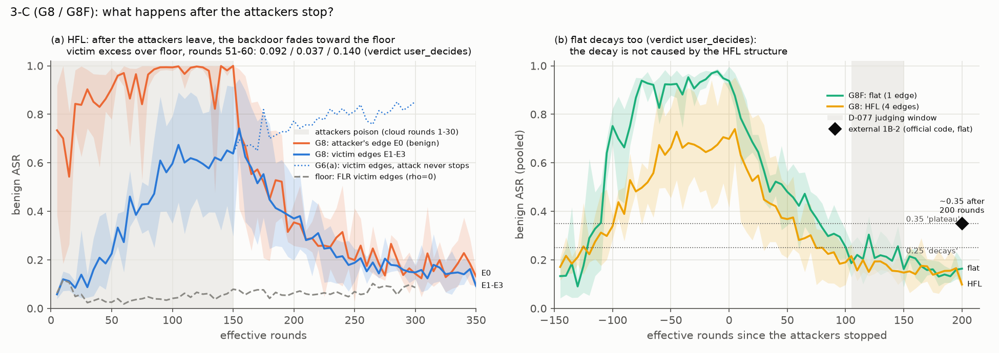

*读图*：(a) HFL（G8），灰底 = 攻击者投毒的第 1–30 云轮。橙 = 攻击者所在 edge 的良性端，蓝 = 受害 edge，
蓝点线 = 攻击者一直不走的 G6(a)，灰虚线 = floor。攻击者一走，两条都往下掉，到第 250 有效轮以后在 0.1–0.2，接近 floor。
(b) 从攻击者停手的时刻对齐：flat（G8F，绿）和 HFL（G8，黄）一样衰减，末段都在 0.25 以下；
黑菱形 = 外部 1B-2（官方代码、flat）200 轮后约 0.35。灰底 = D-077 的判定窗口。

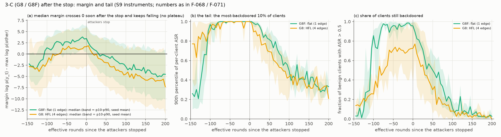

*读图*（S9 常开仪表；图上的数与 F-068 / F-071 的文字逐项相同，`tests/test_report_figures.py` 核对）：
(a) 触发样本的 margin（目标类对数概率减其余最大，> 0 = 判成目标类）的中位数：HFL（黄）停手后 10–45 有效轮过零，
flat（绿）30–55 有效轮过零，之后一路下降、**没有平台**；带子 = p10–p90。
(b) 最容易被植入的 10% 客户端（ASR 的 p90）：停手后 105–150 有效轮 HFL 0.41 / 0.32 / 0.43，flat 0.40 / 0.53 / 0.35；
(c) ASR > 0.5 的良性端比例：HFL 6.3% / 1.7% / 5.8%，flat 8% / 16% / 3%。→ **剩下的是少数客户端的长尾**，HFL 与 flat 相同。

第 1–30 云轮投毒（= 150 有效轮，E0 已饱和、受害 edge 部分植入，F-062），观察到第 70 轮（攻击者走后 200 有效轮）。

| seed | 受害 E1–E3：停手前（28–30）→ 第 51–60 / 61–70 轮 | floor（FLR） | excess | 保留比例 | E0：停手前 → 51–60 | 不停手的 G6(a) 受害 |
|---|---|---|---|---|---|---|
| 42 | 0.674 → 0.175 / 0.167 | 0.083 | **0.092** | 0.155 | 0.985 → 0.213 | 0.794 |
| 43 | 0.348 → 0.142 / 0.093 | 0.105 | **0.037** | 0.152 | 0.994 → 0.145 | 0.657 |
| 44 | 0.878 → 0.197 / 0.178 | 0.057 | **0.140** | 0.171 | 1.000 → 0.216 | 0.995 |

- 预注册判定 `user_decides`（seed 间不一致）；用户判「退回 floor」一支（D-076）：G1 保留 3-C、主量用 margin、另报尾部。
- **margin 没有平台**：良性端触发样本 margin 中位数 s42 在第 33 轮、s44 在第 39–40 轮过零（s43 停手前已为负），到第 70 轮为 −8.8 / −6.9 / −6.3，第 31–70 轮斜率 −0.17 / −0.16 / −0.22 每轮。
- **剩下的是长尾**：第 51–60 轮逐客户端 ASR 的 p90 = 0.41 / 0.32 / 0.43；ASR > 0.5 的良性端 6.3% / 1.7% / 5.8%。
- 观察（`provisional`）：停手后第一轮两个 seed 的受害 edge **反而上升**（s43 0.298 → 0.646），推测是一轮的云聚合传播滞后。
- 存盘（F-067）：每 run logits 54.7 MB（超 D-073 上限 9%）+ 快照 2 × 107.5 MB，三个 run 约 0.81 GB，留在集群 `tfdpfl-dumps/`。**分析做完后删**（用户 2026-09-29 确认）。

```bash
python3 harness/decay_verdict.py
python3 harness/instrumentation_check.py experiments/attack/hfl-mechanism/results/P2/G6/G6__a__s42.metrics.json \
    experiments/attack/hfl-mechanism/results/P2/G8/G8__a__s42.metrics.json --upto 30
```

### 5.8 G8F：flat 对照，以及与外部 1B-2 的对照（F-071 + 本次更正）

（图见 §5.7 (b) 与 margin 图。）

> 更正（2026-09-30，出 margin 图时核对）：F-071 写「flat 的 margin 中位数在有效轮 200–250 过零」。
> 逐 seed 的实际数据：首次过零在有效轮 185 / 205 / 180（s42 / s43 / s44），最后一次 ≥ 0 在 205 / 215 / 175。原文偏晚，定性不变。

良性端池化原始 ASR（有效轮窗口）：

| seed | flat 停手前（140–150）→ 255–300 / 305–350 | 第 350 有效轮单点 | HFL（G8）停手前 → 255–300 | flat − HFL（255–300） |
|---|---|---|---|---|
| 42 | 0.982 → **0.194** / 0.157 | 0.120 | 0.725 → 0.181 | +0.013 |
| 43 | 0.935 → **0.286** / 0.200 | 0.174 | 0.455 → 0.142 | +0.143 |
| 44 | 0.946 → **0.170** / 0.136 | 0.197 | 0.898 → 0.200 | −0.030 |

- 判定 `user_decides`，**只因 s43 = 0.286 落在 0.25–0.35 之间**；末窗口三个 seed 都 ≤ 0.20；保留比例（0.18–0.31）与 HFL（0.22–0.31）几乎相同。
- **解读（`provisional`）**：flat 在本管线里与 HFL 一样衰减 → 衰减**不是 HFL 结构造成的**。

**与外部 1B-2 的对照（用户 2026-09-29 复核后更正）**：另一仓库、官方 Bad-PFL 代码、flat 设定，植入后 200 轮干净训练 ASR 约 **0.35**
（此前记成 0.45，见 FINDINGS N-007 的更正与 F-074）。

| | 停手后 200 轮（有效轮）附近的良性 ASR | 是否停在高位平台 |
|---|---|---|
| 外部 1B-2（官方代码，flat） | 约 0.35 | 否（从植入水平大幅下降） |
| G8F（本管线，flat） | 第 350 有效轮 0.12 / 0.17 / 0.20；305–350 均值 0.14–0.20 | 否 |
| G8（本管线，HFL，受害 edge 原始） | 第 70 云轮 0.079 / 0.108 / 0.090 | 否，已在 floor 附近 |

- **定性一致**：两边都大幅衰减、都没有停在高位平台 —— 与你的判断「基本一致」相同。
- **数值上本管线低 0.15–0.23**。差别里混着训练协议：官方预处理下攻击更强（G7：T50 更早、ASR 更高，F-050）、lr 为常数（本管线按有效轮衰减，D-023）、
  本地训练量与聚合权重（D-024 / D-027）。**哪一项造成的，没有证据**。
- **对 D-077 阈值的影响**：阈值 0.25 / 0.35 是按「外部约 0.45 的平台」写的；更正后外部值正好落在 `flat_plateau` 的门槛上。
  **阈值不改**（数据回来之后改阈值 = 事后判据）；这一条只改变 `flat_plateau` 一支的含义：它原本代表「复现了外部平台」，现在外部值本身也只在门槛上。

```bash
python3 harness/decay_verdict.py --flat
```

### 5.9 G5AB：生成器语义（F-072 / D-080）

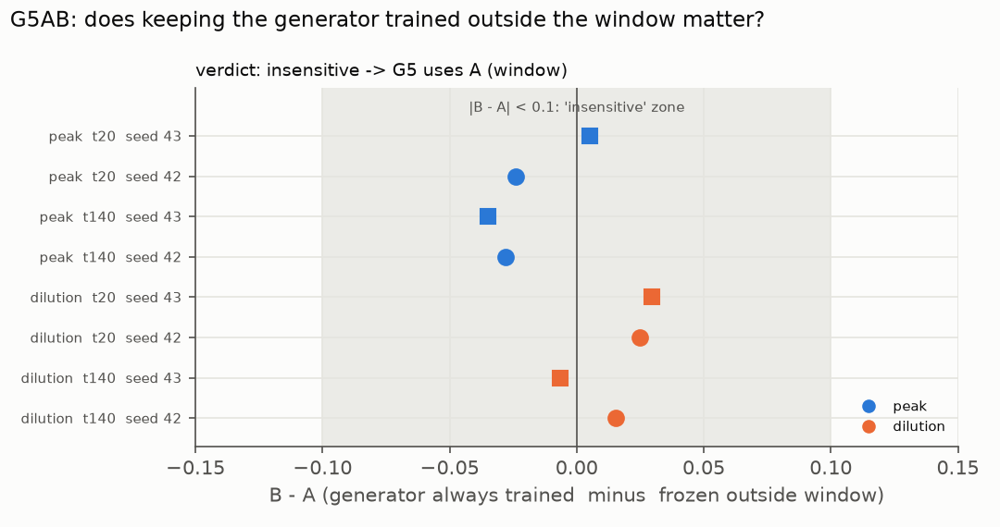

*读图*：每行一个 (量, 格, seed)，横轴是 B − A。8 个点全部落在灰色的 ±0.10「无差别」带里 → `insensitive` → G5 用 A。

| 格 | 峰值 A / B（s42；s43） | 稀释 A / B（s42；s43） |
|---|---|---|
| t20 | 0.179 / 0.155；0.320 / 0.325 | 0.052 / 0.077；0.023 / 0.053 |
| t140 | 0.236 / 0.208；0.329 / 0.294 | 0.082 / 0.098；0.095 / 0.089 |

- 8 个 |B − A| 全部 ≤ 0.035 → `insensitive` → G5 用 A（窗口外生成器冻结）。
- **GPU 上的额外证据**：B 臂在窗口开始前与同 seed 的 G0-random **逐位相同**（t140 两个 seed 各 28 个 checksum、2128 个字段）—— S4 的接线正确。
- **对 G5 的提醒**：稀释点（t0 + 65 … 75 有效轮）已贴着 floor（同轮 G0-random 0.05–0.08）→ 稀释值大概率没有动态范围；
  判定只用峰值。峰值减同轮 floor 后约 0.14–0.27（`g5_verdict.py` 的接线测试：t20 0.143 / 0.207，t140 0.149 / 0.271）。

```bash
python3 harness/g5ab_verdict.py
```

### 5.10 G5：3.3 收敛门控 → `not_gated`（F-076 / D-081）

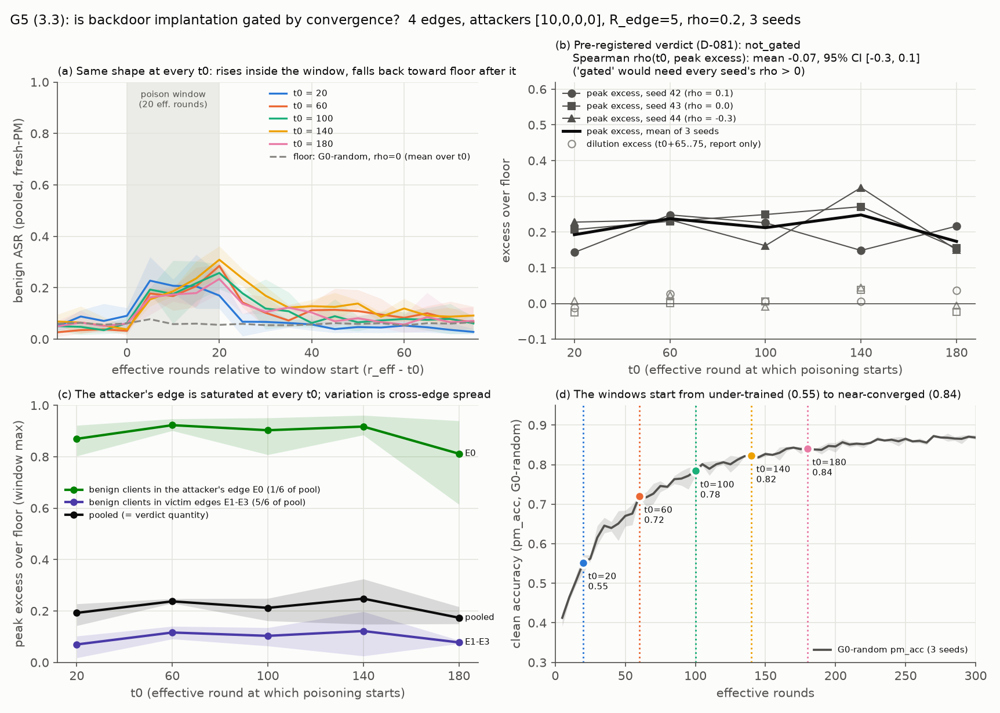

*读图*：
- **(a)** 5 个 t0 的池化良性 ASR，横轴对齐到投毒窗口起点（灰底 = 20 有效轮的窗口）；灰虚线 = 不投毒时的 floor。
  五条曲线形状几乎一样：窗口里升到 0.2–0.3，窗口结束后几十个有效轮内回到 floor 附近。
- **(b)** 预注册的判定量：峰值 excess（窗口内最大值 − 同轮 floor），每个 seed 一条灰线，黑粗线是均值。
  它不随 t0 单调上升（逐 seed ρ = 0.1 / 0.0 / −0.3）。空心点是稀释 excess（只报告），都贴在 0。
- **(c)** 把池化值拆开。池化 = 1/6 × 攻击者所在 edge 的良性端 + 5/6 × 受害 edge，这个关系逐轮成立：
  - 攻击者所在 edge（绿）在每个 t0 都是 0.8–0.9，已经饱和；
  - 池化峰值随 t0 的起伏，来自受害 edge（紫）在窗口里被传染的程度。
- **(d)** 窗口起点处的干净精度从 0.55 走到 0.84。所以 t0 确实从欠训练跨到了接近收敛，不是「t0 选得太窄所以看不出差别」。

| t0 | 峰值 excess s42 / s43 / s44 | 稀释 excess s42 / s43 / s44 |
|---|---|---|
| 20 | 0.143 / 0.207 / 0.228 | −0.013 / −0.025 / 0.008 |
| 60 | 0.248 / 0.230 / 0.234 | 0.027 / 0.001 / 0.024 |
| 100 | 0.226 / 0.249 / 0.162 | 0.006 / 0.006 / −0.009 |
| 140 | 0.149 / 0.271 / 0.325 | 0.006 / 0.039 / 0.045 |
| 180 | 0.217 / 0.155 / 0.150 | 0.037 / −0.024 / −0.006 |

**判定结果与附带检查**

- 判定：逐 seed ρ(t0, 峰值 excess) = 0.1 / 0.0 / −0.3，均值 −0.067，CI [−0.3, 0.1]，结论是 **`not_gated`**。
  稀释的 ρ 是 0.7 / 0.4 / −0.1，只报告。
- 有效性：15 个 run 全部 exit 0，`client_failures` 和 `errors` 都是空的，起止轮与 `generator_schedule = window` 都生效了。
- 跨作业复现：t20 / t140 × s42 / s43 与 G5AB-A 逐轮 checksum 全等（19 / 43 轮），相当于 GPU 上跨作业再证了一次确定性。

**防御含义**：攻击者所在的 edge 在任何训练阶段都是一开窗就被植入，所以**不存在「训练后期较安全」的时段**，检测要一直开着。

**没有证据的地方**：
- 原实验 1 看到「植入受收敛门控」，这里没有复现。差别出在哪里（原配置欠训练、协议不同等）没有逐项证据。
- 3 个 seed、5 个 t0 的设计只能排除较大的单调效应，小幅上升测不出。

```bash
python3 harness/g5_verdict.py --json experiments/attack/hfl-mechanism/analysis/g5_verdict.json
python3 harness/report_figures.py --only G5
```

### 5.11 P1 / P0：只作背景

旧方案 25 个 yaml 全是 `partition: noniid` + `edge_assignment: block`，edge 的数据构成与编号无关（F-005）；旧 rho0 格回退到静态 BadNet，不是 Bad-PFL 的下限（F-006）；
6 个 `def_*` 格其实没开防御（F-001 / 陷阱 #19）；同配置同 seed 第 1 轮就分叉（F-002，P2 已修）。这些缺陷是改版的起因，P1 的数只用来估噪声与效应量。

---

## 6. 3-B 详细说明

### 6.1 问题

后门从攻击者所在的 edge（E0）迁移到其他 edge 时，**受害 edge 自己有没有目标类（airplane）的自然样本**重不重要？
如果触发器是「借用」目标类的自然特征来生效，那么一个几乎没有 airplane 的 edge 应该更难被植入。

### 6.2 设计

- 拓扑：4 edge、每 edge 25 端、攻击者集中在 E0（[10,0,0,0]，E0 里 40% 是攻击者）、R_edge = 5、每端 500 张（等大小）、ρ = 0.2、3 seed；
  自适应停止判据开（G3 实际停在 31–60 云轮，`converged` 为主，C2 s42 跑满 60）。
- **机构式比例表**（D-062 / D-067）：E0 各类 0.10；受害 E1 偏重 automobile + truck、E2 偏重 cat + dog、**E3 偏重 deer + horse**（各 0.25）。
  **C1–C4 之间只改 airplane（y_t）那一列**：

  | 格 | airplane 占比 E0 / E1 / E2 / E3 | 用途 |
  |---|---|---|
  | C1 | .10 / .10 / .10 / .10 | 基准 |
  | C2 | .30 / .03 / .03 / .03 | 攻击者 edge 富含 y_t、受害 edge 都缺 |
  | **C3** | .10 / .10 / .10 / **.005** | **只有 E3 缺 y_t**（判定用） |
  | C4 | **.005** / .10 / .10 / .10 | 只有攻击者 edge 缺 y_t |

  另有层级 Dirichlet 四档（α_e = 0.1 / 0.3 / 1 / 10），y_t 占比随 seed 变，用于连续回归（探索性，§6.6）。
- **为什么用差中差**：机构式比例表下三个受害 edge **不可交换**（E3 偏重的是 deer + horse，本身就可能与 E1 / E2 不同），
  所以「E3 − E1/E2 均值」这个对比里混着与 airplane 无关的 edge 差异。**减去同一对比在 C1 下的值**（C1 与 C3 只差 E3 的 airplane 列）就把这部分消掉。
- **预注册规则**（`PLAN.md` §3，D-062，数据回来之前）：

  DiD = [E3 − (E1 + E2)/2]_C3 − [E3 − (E1 + E2)/2]_C1，用 **excess ASR**（减同 seed、同划分 G0 的 floor），按 seed 配对 bootstrap；
  CI 全 < 0 → 迁移依赖目标类的自然特征；CI 含 0 → 无差异。

### 6.3 数据：原始 → floor → excess

窗口 = 每个 G3 run 的末 10 个评估点；floor 取 G0 的**同一批云轮**。值是 E1 / E2 / E3。

**原始 ASR**（G3）：

| 格 / seed | 窗口（云轮） | E1 / E2 / E3 | 对比 c(raw) |
|---|---|---|---|
| C1 / 42 | 23–32 | 0.898 / 0.854 / 0.875 | −0.001 |
| C1 / 43 | 29–38 | 0.938 / 0.952 / 0.941 | −0.004 |
| C1 / 44 | 34–43 | 0.992 / 0.982 / 0.990 | +0.003 |
| C3 / 42 | 23–32 | 0.954 / 0.931 / 0.945 | +0.002 |
| C3 / 43 | 39–48 | 0.974 / 0.969 / 0.987 | +0.016 |
| C3 / 44 | 33–42 | 0.979 / 0.952 / 0.977 | +0.011 |

**floor**（G0，同轮）：

| 格 / seed | E1 / E2 / E3 | 对比 c(floor) |
|---|---|---|
| C1 / 42 | 0.096 / 0.080 / 0.055 | −0.033 |
| C1 / 43 | 0.060 / 0.036 / 0.046 | −0.002 |
| C1 / 44 | 0.044 / 0.058 / 0.047 | −0.004 |
| C3 / 42 | 0.121 / 0.102 / **0.005** | −0.106 |
| C3 / 43 | 0.061 / 0.042 / **0.003** | −0.048 |
| C3 / 44 | 0.062 / 0.070 / **0.003** | −0.064 |

**excess = 原始 − floor**：

| 格 / seed | E1 / E2 / E3 | 对比 c(excess) |
|---|---|---|
| C1 / 42 | 0.802 / 0.773 / 0.820 | +0.032 |
| C1 / 43 | 0.878 / 0.915 / 0.894 | −0.002 |
| C1 / 44 | 0.948 / 0.925 / 0.943 | +0.007 |
| C3 / 42 | 0.832 / 0.830 / 0.940 | +0.109 |
| C3 / 43 | 0.912 / 0.927 / 0.984 | +0.064 |
| C3 / 44 | 0.916 / 0.883 / 0.974 | +0.075 |

**差中差**（C3 − C1）：

| seed | DiD(原始) | DiD(floor) | **DiD(excess)** = 原始 − floor |
|---|---|---|---|
| 42 | +0.003 | −0.073 | **+0.077** |
| 43 | +0.020 | −0.046 | **+0.067** |
| 44 | +0.008 | −0.060 | **+0.068** |

bootstrap 均值 +0.070，95% CI [0.067, 0.077] → **CI 全 > 0**，两条预注册分支都没落上（脚本记为 `opposite`）。
（第四位小数与 F-073 的 +0.0765 / +0.0676 差 1，是舍入先后的差别。这一节的数字记为 F-075。）

### 6.4 为什么说这是机械结果

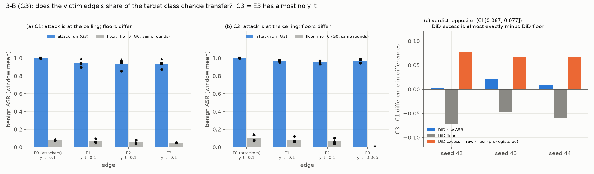

*读图*：(a)(b) 蓝柱 = 攻击后的 ASR，灰柱 = 同 edge 的 floor（黑点 = 各 seed）。C1 与 C3 的蓝柱都顶在 0.93–1.0 —— 天花板；
差别只在灰柱：C3 的 E3 几乎没有目标类，floor ≈ 0。(c) 差中差拆成三根柱：原始（蓝）≈ 0，floor（灰）为负，
预注册的 excess（橙）= 原始 − floor ≈ −floor → 那个「CI 全 > 0」完全来自 floor。

恒等式 **DiD(excess) = DiD(原始) − DiD(floor)**。三个 seed 里：

- **DiD(原始) ≈ 0**（+0.003 … +0.020）：C1 与 C3 的受害 edge 都在 0.85–0.99，**贴着天花板**，E3 就算「更难植入」也表现不出来；
- **DiD(floor) ≈ −0.05 … −0.07**：C3 的 E3 几乎没有 airplane → floor 只有 0.003–0.005，E1 / E2 是 0.04–0.12（§5.6：floor 跟着 y_t 占比走）；
- 于是 DiD(excess) ≈ −DiD(floor)：「减 floor」把 **floor 的差原样搬进了结论**。它说的是「E3 的 floor 低」，不是「后门更容易迁移到 E3」。

所以这组数据**既不支持也不否定** 3-B 的假设：在天花板下，这把尺子测不出来。
（作为量级参照：C1 下本不该有差别的 E3 − E1/E2 floor 对比也有 −0.033 / −0.002 / −0.004 —— floor 的 edge 间噪声约 0.03。）

### 6.5 C2 的观察（F-066，`provisional`）

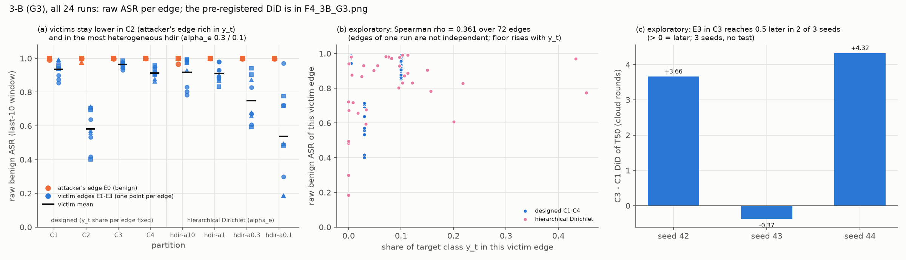

*读图*：(a) 全部 24 个 G3 run 的逐 edge 原始 ASR（橙 = 攻击者所在的 E0，蓝 = 受害 edge，一个点一个 edge，黑线 = 受害均值）。
C1 / C3 / C4 与 α_e = 10 / 1 的受害 edge 都在 0.9 左右，**低的只有 C2（约 0.58）和最异质的 hdir（α_e 0.3 约 0.75、0.1 约 0.54）**；
(b) 受害 edge 自己的目标类占比 vs 它的原始 ASR（探索性，ρ = +0.36；同一 run 的 edge 不独立，而且 floor 也随 y_t 升高）；
(c) C3 − C1 的「越过 0.5 的时刻」差中差：两个 seed 为正（C3 的 E3 更晚被植入），一个为负。3 个 seed，没有检验。

C2（攻击者 edge airplane 0.30、受害 edge 都只有 0.03）的受害 edge 原始 ASR 只有 **0.53 / 0.60 / 0.62**，比 C1 低 0.35 / 0.34 / 0.37 —— 本组最大的差别。
但 C3 的 E3（airplane 0.005，比 C2 的受害 edge 更缺）并不低 → 「受害 edge 自己缺目标类 → ASR 低」**解释不了 C2**。
C2 同时改了攻击者 edge（airplane 0.10 → 0.30，E0 的 floor 在第 51–60 轮升到 0.16–0.20）和受害 edge，两件事分不开。
层级 Dirichlet 里有一个相似的例子：α_e = 0.1 的 s44，E0 的 airplane 0.46、受害 edge 都是 0 → 受害 edge 0.19 / 0.18 / 0.50。
**机制没有证据**；一个可检验的假设是「攻击者 edge 富含目标类时，E0 的 body 学到的是目标类的自然特征而不是触发器，迁移出去的后门更弱」。

### 6.6 探索性读数（看过数据之后才看的量，不参与判定）

- **越过 0.5 的时刻（T50，云轮，逐 edge 插值）**：C1 / C3 的末 10 点虽然都在天花板，**植入的快慢**并没有饱和。
  对比 c(T50) = T50(E3) − T50 的 E1 / E2 均值：C1 为 −1.72 / −0.91 / −0.83，C3 为 +1.94 / −1.28 / +3.50；
  **差中差 +3.66 / −0.37 / +4.32 云轮** —— 两个 seed 里 C3 的 E3（没有 airplane）**更晚**被植入，与假设方向一致，另一个 seed 相反。
  3 个 seed、方向不一，不能下结论；而且 T50 不是预注册的量，只能当下一步的假设。
- **秩相关**（全部 24 个 G3 run，含 hdir；edge 之间不独立，只作描述）：
  攻击者 edge 的 y_t 占比 vs 受害 edge 原始 ASR 均值 ρ = −0.26（24 个 run）；受害 edge 自己的 y_t 占比 vs 它的原始 ASR ρ = +0.36（72 个受害 edge）。
  后者**混着 floor**（floor 本身随 y_t 升高），不能当成「迁移依赖自然特征」的证据。
- hdir 四档没有 floor（G0 不含 hdir），只有原始值；α_e = 0.1 时 y_t = 0 的受害 edge ASR 从 0.18 到 0.72 都有（`analysis/g3_did.json` 的 `explore_hdir`）。

### 6.7 三条出路（都需要你拍板；任何一条都要先写预注册规则再交）

| 出路 | 做什么 | 能回答什么 | 代价 | 风险 |
|---|---|---|---|---|
| ① G3 带仪表重跑 | C1 / C3 × 3 seed 在 S9 代码上重跑（6 run，配置不变；仪表不改数 → 停轮与原 run 相同）；主量换成**触发样本 margin 的中位数**（不饱和），floor 用 G0 已有的 margin 列 | 天花板下 E3 的 margin 是否比 E1 / E2 低 | 约 4.3 GPU-h（G3 的 C1 / C3 两包实测 1.93 + 2.36） | 你之前搁置了这一条；margin 的 floor 差可能同样机械（要先看 G0 的 margin 列） |
| ② 降低攻击强度离开天花板 | 先 1 个探路包找投毒率（如 ρ 0.2 → 0.05），让受害 edge 落在 0.4–0.7；再跑 C1 / C3 × 3 seed。**只降 ρ 时 floor（ρ=0）不变、G0 直接复用**；改攻击者人数则 floor 要重测 | 原始 ASR 本身能分辨时的差中差 | 探路约 2.5 GPU-h + 正式 6 run 约 4.3–5 GPU-h（低强度可能跑到 cap） | 强度改了，与其他组的可比性下降；探路要先定「落在 0.4–0.7」的判据 |
| ③ C1 / C3 的攻击停止版 | 像 G8：在受害 edge 饱和之前停手（如第 10 云轮），固定观察到第 60 轮（停止判据关） | 缺 y_t 的 E3 是不是**更快**丢掉后门（衰减段不在天花板上） | 6 run 约 5.5 GPU-h（按 G8 的 70 轮 3.1 h / 包外推） | 停手轮要先定；衰减速度与植入难度不是同一个问题 |

**我的建议**：若 3-B 仍在论文范围内，先做 ①（最便宜、配置不变、直接复用 G0 的 margin floor），先在 G0 上核对 margin 的 floor 差是否也随 y_t 走；
若 ① 的 margin 也贴顶或同样机械，再考虑 ②。T50 的方向（§6.6）只能作为 ① / ② 预注册时的一条副假设。

```bash
python3 harness/g3_did.py --json experiments/attack/hfl-mechanism/analysis/g3_did.json
```

---

## 7. 工具链与文件索引

### 7.1 文档

| 文件 | 内容 |
|---|---|
| `hfl-mechanism/README.md` | 工作流与规矩（本报告里的命令都出自这里） |
| `hfl-mechanism/current-focus.md` | 当前交接：下一步是什么 |
| `hfl-mechanism/PLAN.md` | 评审、子实验 → 代码映射、**预注册判定（§3）**、运行组（§4）、会话路线（§5）、图目录（§6） |
| `hfl-mechanism/AUDIT.md` | 与官方 Bad-PFL / FedRep 的对齐审计（2026-09-27 全部关闭） |
| `hfl-mechanism/DECISIONS.md` | 决策日志 D-001 … D-081（只追加） |
| `hfl-mechanism/FINDINGS.md` | 证据台账 F-001 … F-075、设计备注 N-001 … N-007 |
| `hfl-mechanism/PLAN-original-2026-09-24.md` | 原始规划，逐字保存 |
| `CLAUDE.md` | 仓库级约定、集群环境、已确认的陷阱 #1 … #23 |

### 7.2 登记与提交

| 文件 | 作用 |
|---|---|
| `hfl-mechanism/registry.yaml` | 运行组声明（因素、seed、`requires`）；`available` 列已完成的功能会话 |
| `hfl-mechanism/base.yaml` + `fedavg/config/alignment_p2.yaml` | P2 基配置 + 对齐模板（D-039） |
| `hfl-mechanism/configs/`（90 个）+ `INDEX.tsv` | materialize 生成的完整配置，不要手改 |
| `hfl-mechanism/submit.sh` / `submit_lib.sh` / `cell.sbatch` / `pack.sbatch` | 提交（登录节点，纯 bash）；`PACK=3` 一卡三跑、防 OOM、防重交 |
| `hfl-mechanism/pilot/`（registry / configs / submit_pilot.sh / submit_pack_test.sh） | A4 pilot（P1 口径） |

### 7.3 harness（纯标准库 + PyYAML，本地与登录节点都能跑）

| 脚本 | 做什么 |
|---|---|
| `registry.py` | 列出各组 run 数 / `--materialize` 生成配置 |
| `status.py` | 逐格对账：todo / blocked / failed / mismatch / stale / done + orphan |
| `collect_metrics.py` | 日志 → metrics.json（schema 8） |
| `runs_table.py` | 按实际因素分组的整洁表，拒绝混合口径 |
| `verdicts.py` | PLAN §3 的通用判定（3-A 的 T50 比值）+ `bootstrap_mean_ci` |
| `pilot_a4.py` | pilot 判定（D-029 / D-031 / A15 / G2P）+ 有效性闸 `invalid_reasons` |
| `pack_test.py` | 一卡多跑的加速比 + checksum 验收 |
| `g7_posthoc.py` | G7 的事后判据 |
| `flr_verdict.py` | FLR：floor 是否可忽略 |
| `decay_verdict.py`（`--flat`） | G8 / G8F：攻击停止后的衰减 |
| `g5ab_verdict.py` | G5AB：生成器语义 |
| `g5_verdict.py` | G5：收敛门控（D-081） |
| `g3_did.py` | 3-B：差中差 + 分解表 + 探索性读数 |
| **`g6_verdict.py`** | 3-E：预注册判定（S7，D-059 / D-071；脚本写于数据之后，2026-09-30 新增） |
| `instrumentation_check.py` | 「新代码没改已有的数」：只比 checksum 与已有数值字段 |
| `check_reproducible.py` | 两个 run 全部字段（含计时）是否相同 |
| `partition_preview.py` | 离线预览 S3 划分的异质性（F0 数据，不需要 TF） |
| `figures.py` | 出图基元：按因素分组的轨迹 / 逐 edge 小多图（组内因素不唯一会被拒绝） |
| **`report_figures.py`** | 本报告 §0 的结果图（2026-09-30 新增；数取自上面各判定脚本，`tests/test_report_figures.py` 逐项核对） |
| `git_size_report.py` | git 历史的空间占用（只读，附录 A） |
| `analyze_exp3.py` / `collect_matrix.py` / `evidence_data_split.py` | 旧方案用 |

### 7.4 代码模块（`fedavg/`，改版实验相关）

| 模块 | 作用 |
|---|---|
| `client/client_badpfl.py` | Bad-PFL 攻击 mixin（ξ / δ / 生成器，闸门 `_attack_active` / `_gen_active`） |
| `attack/attack_window.py` | 投毒窗口 [start, stop) 与生成器语义（S4，不 import TF） |
| `attack/eval_detail.py` / `attack/backdoor_eval.py` | 评估仪表（S9）/ 三层 ASR |
| `server/backdoor_server.py` / `server/hier_fedrep.py` | 评估驱动、fresh-PM（`main_pm`）、存盘 |
| `server/stopping.py` | 自适应停止判据 |
| `data/designed_partition.py` | S3 划分（不 import TF） |
| `utils/tier_split.py` | 3-E 的 edge 段 / cloud 段索引（不 import TF） |
| `alignment.py` / `config_validate.py` | 对齐开关表 / 启动时校验（P2 逐键核对） |
| `utils/provenance.py` | `[Provenance]`：git、口径版本、config_sha |

---

## 8. 机时账

| 批次 | 作业 | 实测 GPU-h | 事先估计 |
|---|---|---|---|
| pilot 第二轮（DET 2、D029 2、A26 2） | 单跑 | 9.5 | — |
| G2P（2 个新格） | 单跑 | 5.7 | — |
| PACK 测试 | 2 包 | 0.8 | — |
| G7 | 6 单跑 | 11.7 | — |
| G6 | 3 个 K=2 探路包 + 1 个 K=3 合包 + 1 个单跑补交 | 15.6 | — |
| FLR | 1 × K=3 | 3.0 | — |
| G3 | 8 × K=3 | 18.5 | — |
| G8 | 1 × K=3 | 3.1 | — |
| G6D | 1 × K=3 | 3.2 | — |
| G0 | 5 × K=3 | 12.2 | — |
| G5AB | 4 × K=2 | 4.8 | 约 5 |
| G8F | 1 × K=3 | 4.6 | 3.5（flat 的 350 个云轮比外推贵） |
| G5 | 5 × K=3 | 6.4 | 约 7 |
| S5P（S5 的 GPU 探路） | 2 × K=2 | 0.6 | 约 1 |
| **合计** | | **约 100** | |

- 单跑的 GPU-h 取 `timing_summary` 的训练 + 评估墙钟（不含启动）；包取 `*.gpu.json` 的墙钟。pilot 第一轮（6 个 run 全崩，F-043）没有计入。
- 上限约 100 GPU-h / 周（D-047）。挡住的 91 个 run 按 PLAN §4 的每 run 约 0.9 GPU-h（K=3）外推 ≥ 80 GPU-h；10edge / R20 格没有实测，会更贵（G2P 的 10edge 单跑 3.3 h）。

```bash
python3 - <<'EOF'
import json, glob
for f in sorted(glob.glob('experiments/attack/hfl-mechanism/results/P2/*/*.gpu.json')):
    print(f.split('/')[-1], round(json.load(open(f))['wall_s'] / 3600, 2))
EOF
```

---

## 9. 下一步与待决事项

**集群上**：已登记的可交格子全部回传（S5P 是最后一批，2026-10-02），没有在跑的作业。

### 9.1 还没做的实验（2026-09-30，`python3 harness/status.py …/registry.yaml`）

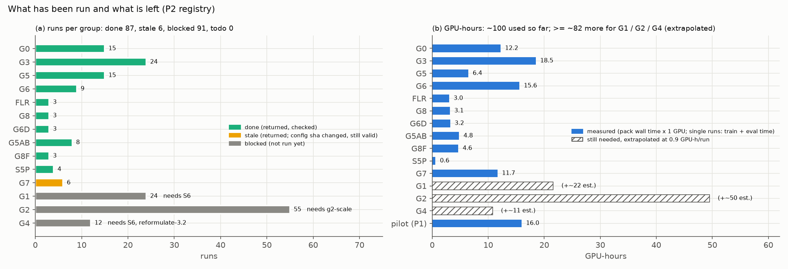

*读图*：
- (a) 每组 run 数：绿 = 已回传核对，黄 = 已回传但配置 sha 变了（G7，结果仍有效，D-053 默认不重交），灰 = 还没跑（右边写着缺哪个功能会话）；
- (b) 机时：蓝 = 实测，斜线 = 按每 run 0.9 GPU-h **外推**的待用量（10edge / R20 没有实测，实际会更多）。

**登记表里还没跑的 3 组（91 run）**：

| 组 | 回答什么 | 设计 | run | 挡在哪 | 外推机时 | 谁定 |
|---|---|---|---|---|---|---|
| **G1** | 3-C 锯齿（一个云周期内干净 edge 能否自清洁；按 D-076 主量用 margin、另报尾部）+ 3-D（edge 视角能否更好地检测恶意更新）+ 3-A 的一部分 | 4 edge；划分 {random, C1} × 布点 {集中, 分散} × R_edge {10, 20} × 3 seed | 24 | ~~S5~~ ✅（2026-10-01，D-084；G1 的网格留给 S6 定）+ **S6**（更新日志 / 几何分数 / 周期转储 / 离线 c_k） | ≥ 22 GPU-h | S6 的范围可以开始定 |
| **G2** | 3-A：HFL 是否结构性地延迟植入（T50 比值，5 seed） | flat + {2, 4, 10} edge × R_edge {2, 5, 10, 20}，去掉 G1 已覆盖的格 × 5 seed | 55 | ~~S5~~ ✅（网格已写进 set）+ **`g2-scale`**（D-084） | ≥ 50 GPU-h；S5 的网格相对旧登记约省 6–9 GPU-h（外推，F-079） | **规模仍未定**（D-056）；G2P 单 seed 已 `consistent`；定了就把 `g2-scale` 加进 `available` |
| **G4** | 3.2：私有 head 能否吸收后门 | ρ {0.25, 1.0} × {FedRep, FedAvg} × 3 seed | 12 | **S6** + 3.2 按 N-003 重新表述 | ≥ 11 GPU-h | **搁置**（D-047：FedAvg 臂会立刻被攻陷，给不出结论） |

**不在登记表里、但已经提过的补充实验**（都要先写预注册规则再交）：

| 事 | 为什么 | 代价 | 出处 |
|---|---|---|---|
| 3-B 的三条出路（三选一或不做） | 当前攻击强度下 3-B 判不出（天花板，§6） | 4.3 / 7–8 / 5.5 GPU-h | §6.7 |
| hdir 四档的 floor | G0 不含 hdir，hdir 只有原始 ASR（F-075） | 12 run（4 档 × 3 seed，ρ=0） | D-066 |
| 3-E 的 floor 格（ρ=0 × b / c 两臂） | 「三臂 floor 相同」没有证据（D-059）；a 臂的 floor 就是 FLR | 6 run（2 臂 × 3 seed） | D-059 |

**不需要 GPU、还没做的分析与图**：
- G8 存盘（logits + 快照，约 0.81 GB，在集群 `tfdpfl-dumps/`）的离线分析：长尾客户端复算、迁移 baseline（F-068 / D-078）。分析做完才能删存盘。
- 图目录里还缺 4 张：
  - F2 T50 森林图，等 G2（现在只有 pilot 版 `G2P_T50_ratio.png`）；
  - F3 锯齿热条，等 G1（衰减版已出）；
  - F5 edge 视角 vs 全局视角的 ROC，等 G1；
  - F6 3.2 的对照，等 G4。
- `experiments/METRICS.md` 里「ξ 用 mal[0]」一句要按 D-015 + D-033 改（该文件与 Bad-PFL 库双份同步，由你改）。

### 9.2 待你决定

| # | 事项 | 选项 | 依据 |
|---|---|---|---|
| 1 | **3-B** | ① G3 带仪表重跑（约 4.3 GPU-h）/ ② 降投毒率（约 7–8 GPU-h）/ ③ 攻击停止版（约 5.5 GPU-h）/ 不做，3-B 记为「当前强度下不可判定」 | §6.7 |
| 2 | **git 瘦身** | 不改历史（部分克隆）/ 改写历史（`.git` 289 → 9.3 MiB） | 附录 A |
| 3 | G2 规模 | G2P 已 `consistent`（单 seed）；**S5 已完成**（D-084），G2 的网格已写进 set、挂着 `g2-scale`。S5P 已回传（F-079）：GPU 上开 / 关网格逐位相同；轻评估点约 35 s。相对旧登记，R2 格每 run 约 −2.3 h、R10 +0.29 h、R20 +0.44 h（外推，只有 2 edge 的单价）；网格下 flat 的停止判据严 5 倍，可能跑到 cap 300（F-078） | D-047 / D-055 / D-056 / D-083 / D-084 |
| 4 | G1 的重新规划 | 按 D-076：保留 3-C、主量 margin；需要 S5 + S6 | D-074 / D-076 |
| 5 | ~~3-E 的判定代码（S7）~~ | ✅ 已写（2026-09-30）：两臂都 `blocks`；注意陈旧列的精度代价（c 臂 0.027–0.029）超过 0.02 | §5.4 / F-077 |
| 6 | G8 存盘删除时机 | 已定「分析做完后删」；消费它的离线分析（margin / 逐客户端的离线复算）还没开始 | D-073 |
| 7 | 合并到 main | 你已定「先不合并」；`origin/main` 停在 2026-08-26（`cf40b13`），本分支领先 50 个提交（2026-09-30） | CLAUDE.md 分支纪律 |
| 8 | ~~3.3 是否收尾~~ | ✅ 已定（2026-10-01）：收尾，记 `not_gated`，范围见 D-082；不再追加实验 | §5.10 / F-076 / D-082 |

### 9.3 已知没有证据的地方（集中列出，免得被当成结论）

- 衰减在本管线比外部 1B-2 低 0.15–0.23 的原因（预处理 / lr / 本地训练量 / 聚合权重，逐项消融才分得开）；
- floor 为什么跟着 y_t 占比走（推理，不是测量）；
- C2 受害 edge 低的机制（§6.5）；
- 3-A 的幅度（单 seed）；
- 10edge / R20 格的显存与机时（G2 / G1 的外推）；
- 3-E 三臂的 floor 是否相同（D-059）。

---

## 附录 A：git 瘦身

### A.1 谁占了空间

`python3 harness/git_size_report.py`（只读）：全部历史里 9481 个 blob、磁盘 **289.0 MiB**，其中 **279.7 MiB（96.8%）** 是早已删除、只留在历史里的垃圾：

| 类别 | 磁盘 | 进出历史的提交 | 现在还被跟踪吗 |
|---|---|---|---|
| 7 个 `fedavg/wrn28_4_*-sweep-*.h5` 权重（各 20.8 MiB） | 145.4 MiB（50%） | `cfb2361`（04-08）加入 → `b42c27f`（08-19）删除 | 否 |
| 误提交的 venv（`lib/python3.11/site-packages/` 下 pyarrow 等几千个文件） | 69.5 MiB（24%） | `1614963` / `7ae2966` 加入 → `ffd3a68`（08-23）删除 | 否 |
| `fedavg/wandb/` 与 `fedavg_v2/fedavg_v2/wandb/` 运行记录 | 63.7 MiB（22%） | `cfb2361` / `9f67760` 加入 → `b42c27f` 删除 | 否 |
| 日志 / txt | 3.9 MiB | — | 部分 |
| 代码 / 配置 / 文档 | 2.7 MiB | — | 是 |
| metrics.json（全部 184 个版本） | 1.9 MiB | — | 是 |

- 当前工作树只有约 26 MB（584 个文件），最大的跟踪文件是 `hfl-propagation/results/exp3_analysis.json`（588 KB）和 G8F 的 metrics.json（各约 300 KB）。
- 本地 `.git` 显示 364 MB（含本地重复的 pack）；**新克隆是 289 MiB**。
- `.gitignore` 早已覆盖这三类，**不会再长**；新增的 `tests/test_repo_hygiene.py` 在 L1 里再守一道（单文件 > 10 MB、`*.h5 / *.pt / *.ckpt / *.npz / *.npy`、wandb、venv、`tfdpfl-dumps/`）。
  反向锚点：这些规则对历史里的 10339 条路径拦下 6551 条 venv、2610 条 wandb、9 个权重、13 个数组。

### A.2 两个选项

**选项 1：不改历史，只改克隆方式**（零风险，今天就能用）

| 克隆方式 | 实测 `.git` 大小 | 说明 |
|---|---|---|
| 普通克隆 | 289 MiB | 现状 |
| `git clone --filter=blob:none --branch <分支> <url>` | **4.4 MB**（检出本分支后；检出 main 为 1.6 MB） | 只下载提交与目录树，文件内容按需下载；`git log` 照常，`git checkout` 旧提交时才联网取 |
| `git clone --depth 1 --branch <分支> <url>` | 0.8 MB | 只有最新一个提交；看不了历史、`git log` 只有一行 |
| `git clone --filter=blob:limit=1m <url>` | 44 MB | 大文件不下，但 venv 的几千个小文件仍会下 |

集群上重新克隆一次（或新会话）用 `--filter=blob:none` 即可；远端仍是 289 MiB。

**选项 2：改写历史**（在 scratch 副本里模拟过，**没有**动真仓库）

- 命令：`git filter-repo --invert-paths --path-glob '*.h5' --path-glob '*.pt' --path-glob '*.pth' --path-glob '*.ckpt' --path lib/ --path lib64/ --path bin/ --path include/ --path share/ --path pyvenv.cfg --path-regex '(^|.*/)wandb/.*'`
- 结果：pack **289.0 → 9.3 MiB**（−97%）。`main` 与本分支的 HEAD 目录树哈希**逐字节相同**；8 个旧分支（dev / old-main / 6 个早期 claude 分支）的末端目录树只少了 wandb / h5 / venv 路径（已逐条核对）；
  1 个提交（`ffd3a68` "stop tracking lib/"）只删 venv，改写后变空、被丢弃。filter-repo 生成了新旧哈希对照表 `commit-map`。
- **代价**：
  1. **所有提交哈希都变**（从 04-08 的 `cfb2361` 起），17 个分支都要强推（含 main）；
  2. 集群和所有本地副本都要**重新克隆**（旧副本一 pull 就会把旧历史混回来）；
  3. 88 个 metrics.json 的 `run.provenance.git`（8 个不同提交）和文档里约 55 处短哈希会**指不到提交** → 要把 `commit-map` 入库，并先存一份旧仓库的 `git bundle` 作备份；
  4. GitHub 上 9 个 PR 的只读引用 `refs/pull/*` 改不了，旧对象在 GitHub 服务器上仍可达；**不影响新克隆的大小**（克隆默认不取 `refs/pull/*`），但远端的「仓库大小」要等 GitHub 自己回收；
  5. ~~进行中的作业（G5）的 provenance 会指向旧哈希。~~ 已不适用：G5 已回传（它的 15 个 metrics.json 并入第 3 条），现在没有在跑的作业（2026-09-30）。
- **这是破坏性、对外可见的操作，需要你单独明确同意才会执行**；建议若要做，趁现在（G5 已回传、没有作业在跑）做，并按上面的 1–5 逐条准备。

**我的建议**：先用选项 1（集群下次重新克隆时加 `--filter=blob:none`）。瘦身的收益只在「克隆」这一步（289 MiB，一次性），
而选项 2 的代价会落在每一份溯源记录上。除非克隆大小确实造成了问题（例如集群配额），否则不改写历史。
